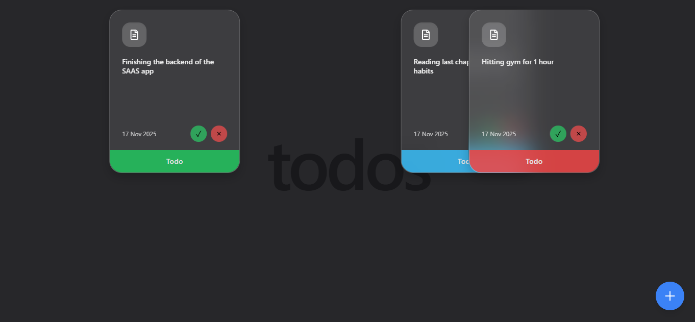

# React Floating Todos

---
A minimal **Todo App** built with **React + Vite + Tailwind + Framer Motion**.  
Todos float around the screen and can be moved with the cursor.  


---

## Features
- Add and delete todos  
- Floating todos (animated with Framer Motion)  
- Drag and move todos anywhere on screen  
- Clean UI with TailwindCSS  
- Fast builds with Vite  

---

## Tech Stack
- [React](https://react.dev/)  
- [Vite](https://vitejs.dev/)  
- [TailwindCSS](https://tailwindcss.com/)  
- [Framer Motion](https://www.framer.com/motion/)  

---

## Run Locally

Clone the project:
```bash
git clone https://github.com/salisai/toDo.git
cd toDo/client

npm install
npm run dev
